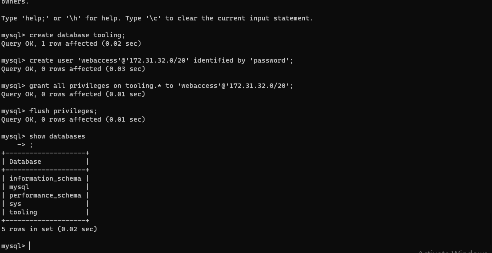
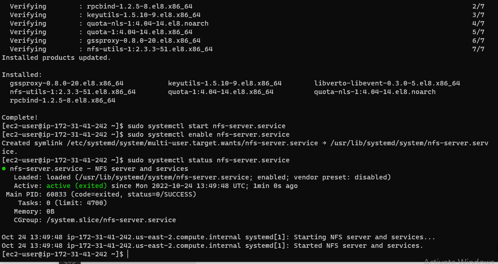
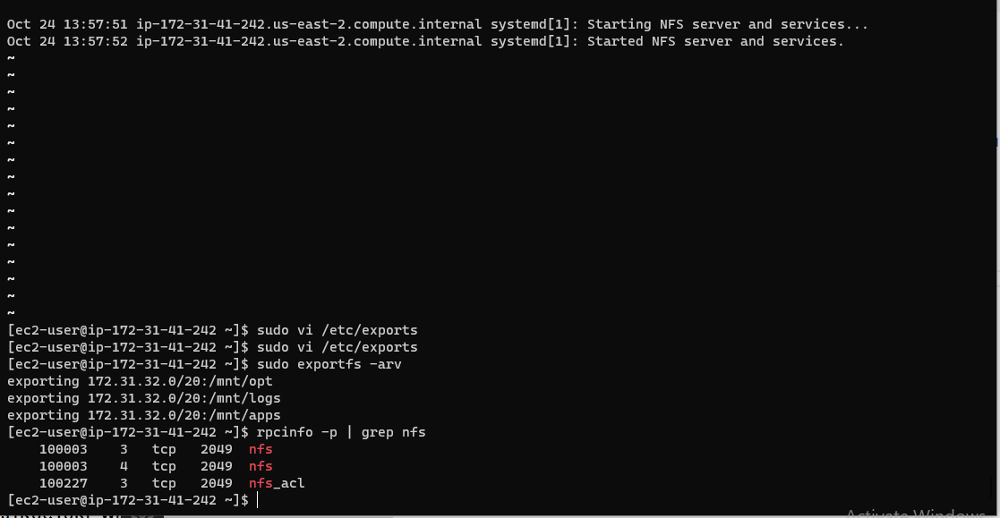
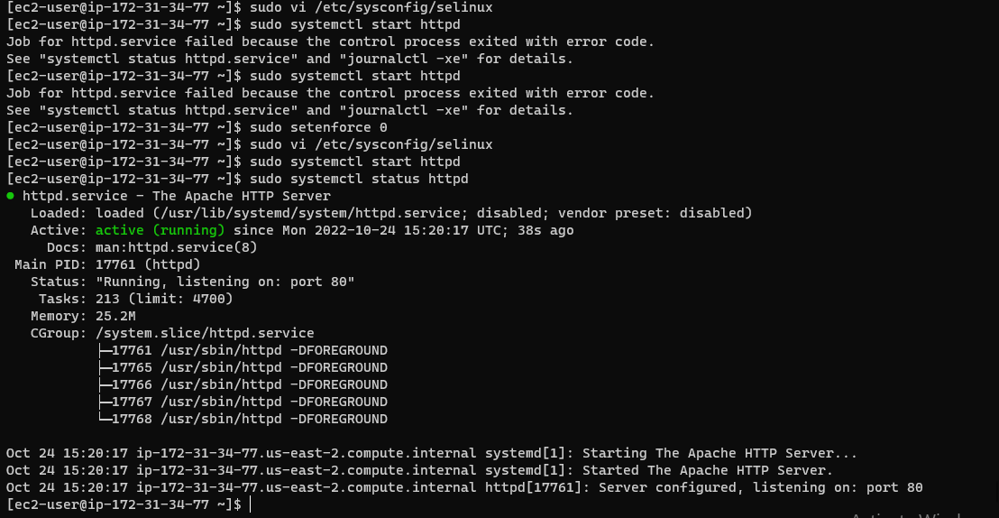
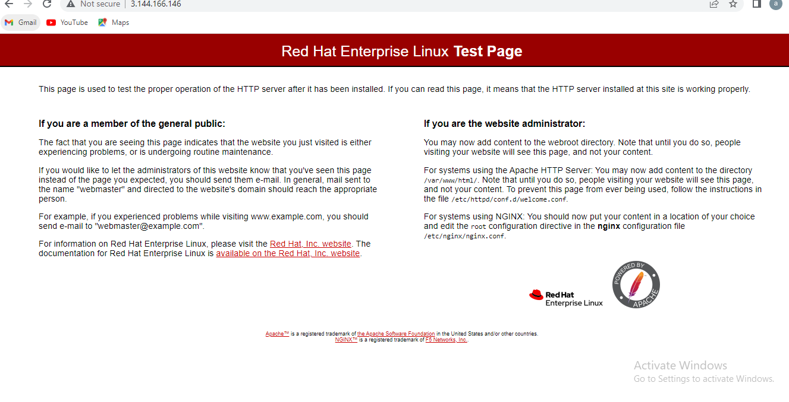
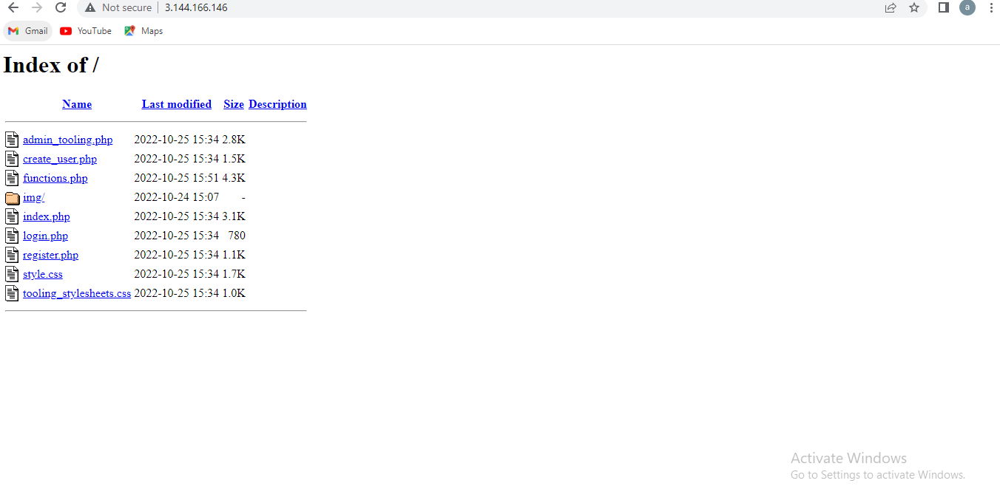
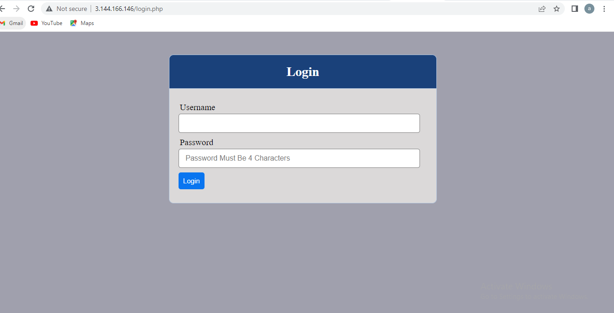

**DEVOPS TOOLING WEBSITE SOLUTION**

**CONFIGURE THE DATABASE SERVER**

****

**Install NFS server, configure it to start on reboot and make sure it is u and running**

****

**Check which port is used by NFS and open it using Security Groups (add new Inbound Rule)**

****

**Apache and PHP**

****

**Red Hat Enterprise Linux Test Page**

****

**admin page created**

****

**Open the website in your browser**

****

